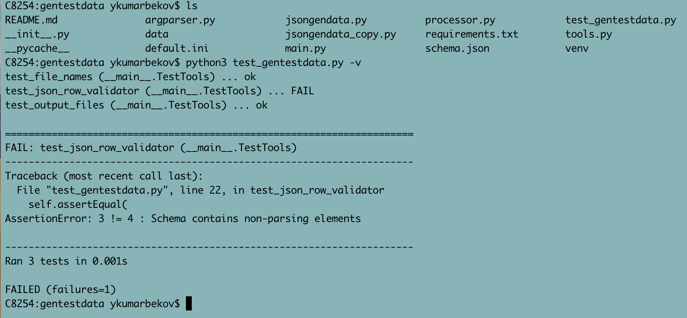

## Console utility to generate random data in JSON format based on input JSON schema

_run:_
```
    python3 main.py arguments
    python3 main.py --h|help (to get additional help)
```
program arguments:  
    --output-path: Output path for generated files  
    --file-name: file name uses as base name for generated files  
    --file-count: number of generated files, must be 0 or above  
    --file-prefix: prefix for generated files, can be - count, random or uuid  
    --schema: JSON schema, can be file or row passed as program argument  
    --data-lines: number of lines in generated files  
    --clear-output-data: remove previously generated files, based on base file name  

By default utility reads all configuration parameters from default.ini.

_running example:_
```
python3 main.py \
--file-count=3 \
--file-prefix='uuid' \
--schema='{"date":"timestamp:", "name": "str:rand", "type":"['client', 'partner', 'government']", "age": "float:rand"}' \
--clear-output-data=1
```
_Generated data_
```
{"date": 1573824466.167286, "name": "a20f05d8d82a4d878864c2bbd6feb4f2", "type": " partner", "age": "41"}
{"date": 1573824466.167349, "name": "901158261ab142dab9103d27854948fa", "type": "client", "age": "78"}
...
```
Utility validates and parses input schema:  
_Example with wrong schema data:_
```
{"date":"timestamp:", "name": "str:rand", "type":"['client', 'partner', 'government']", "age": "float:rand"}'
```
_In this case you will receive next message:_
``` 
WARNING - Number of processed elements: 3 doesn't equal actual elements: 4
```
------------------------

Test cases:   
run: python3 test_gentestdata.py -v

Running testcase:  

